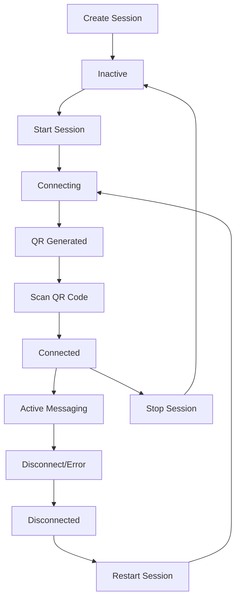

# Session Management

Sessions are the core component of the WhatsApp API. Each session represents a WhatsApp connection for a specific phone number. This guide covers session creation, management, and lifecycle.

## What is a Session?

A session is a WhatsApp connection instance that:
- Represents one WhatsApp phone number
- Handles message sending and receiving
- Maintains connection state
- Stores authentication credentials
- Provides QR code for device linking

## Session Lifecycle



## Session Status

### Status Types

| Status | Description | Actions Available |
|--------|-------------|-------------------|
| `inactive` | Session created but not started | Start, Delete |
| `connecting` | Attempting to establish connection | Stop, Restart |
| `qr_generated` | QR code ready for scanning | Get QR, Clear Auth |
| `connected` | Successfully connected and ready | Send messages, Stop |
| `disconnected` | Connection lost, can be restored | Restart, Clear Auth |

### Status Transitions

```javascript
// Typical flow
inactive → connecting → qr_generated → connected
                ↓              ↓           ↓
            disconnected → qr_generated → connected
```

## Creating Sessions

### Basic Session Creation

```bash
curl -X POST https://api.yourwhatsappapi.com/api/sessions \
  -H "Authorization: Bearer YOUR_JWT_TOKEN" \
  -H "Content-Type: application/json" \
  -d '{
    "name": "Customer Support",
    "description": "Main customer support line"
  }'
```

**Response:**
```json
{
  "success": true,
  "message": "Session created successfully",
  "session": {
    "id": "5bc99cea8975b95fe7077c64a3312145",
    "name": "Customer Support",
    "description": "Main customer support line",
    "status": "inactive",
    "phoneNumber": null,
    "createdAt": "2024-01-01T00:00:00.000Z",
    "updatedAt": "2024-01-01T00:00:00.000Z"
  }
}
```

### Session Configuration Options

```json
{
  "name": "string",           // Required: Display name
  "description": "string",    // Optional: Description
  "settings": {              // Optional: Advanced settings
    "autoReconnect": true,    // Auto-reconnect on disconnect
    "webhookUrl": "string",   // Webhook endpoint
    "messageHistory": true    // Store message history
  }
}
```

## Starting Sessions

### Start a Session

```bash
curl -X POST https://api.yourwhatsappapi.com/api/sessions/YOUR_SESSION_ID/start \
  -H "Authorization: Bearer YOUR_JWT_TOKEN"
```

**Response:**
```json
{
  "success": true,
  "message": "Session started successfully",
  "status": "connecting"
}
```

### Monitor Status

```bash
curl -X GET https://api.yourwhatsappapi.com/api/sessions/YOUR_SESSION_ID/status \
  -H "Authorization: Bearer YOUR_JWT_TOKEN"
```

**Response:**
```json
{
  "success": true,
  "status": "qr_generated",
  "phoneNumber": null,
  "lastActivity": null,
  "qrAvailable": true
}
```

## QR Code Authentication

### Get QR Code

```bash
curl -X GET https://api.yourwhatsappapi.com/api/sessions/YOUR_SESSION_ID/qr \
  -H "Authorization: Bearer YOUR_JWT_TOKEN"
```

**Response:**
```json
{
  "success": true,
  "qrCode": "data:image/png;base64,iVBORw0KGgoAAAANSUhEUgAA...",
  "message": "QR code generated successfully",
  "expiresAt": "2024-01-01T00:05:00.000Z"
}
```

### QR Code Properties

- **Format**: Base64 encoded PNG image
- **Size**: 256x256 pixels
- **Expiry**: 90 seconds
- **Auto-refresh**: New QR generated when expired

### Scanning Process

1. **Get QR Code** from API
2. **Open WhatsApp** on your phone
3. **Go to Settings** → **Linked Devices**
4. **Tap "Link a Device"**
5. **Scan the QR code**
6. **Wait for connection**

### QR Code Examples

#### Display QR in Terminal
```bash
# Get QR code and save as image
curl -X GET https://api.yourwhatsappapi.com/api/sessions/YOUR_SESSION_ID/qr \
  -H "Authorization: Bearer YOUR_JWT_TOKEN" \
  | jq -r '.qrCode' \
  | sed 's/data:image\/png;base64,//' \
  | base64 -d > qr.png

# Display in terminal (with qrencode)
qrencode -o - "$(curl -s ... | jq -r '.qrText')" | display
```

#### Web Display
```html


<script>
async function getQRCode() {
  const response = await fetch('/api/sessions/YOUR_SESSION_ID/qr', {
    headers: { 'Authorization': 'Bearer YOUR_JWT_TOKEN' }
  });
  const data = await response.json();
  document.getElementById('qrCode').src = data.qrCode;
}
</script>
```

## Session Management

### List Sessions

```bash
curl -X GET https://api.yourwhatsappapi.com/api/sessions \
  -H "Authorization: Bearer YOUR_JWT_TOKEN"
```

**Query Parameters:**
- `status`: Filter by status
- `limit`: Number of sessions (default: 50)
- `offset`: Pagination offset

**Response:**
```json
{
  "success": true,
  "sessions": [
    {
      "id": "5bc99cea8975b95fe7077c64a3312145",
      "name": "Customer Support",
      "status": "connected",
      "phoneNumber": "+1234567890",
      "lastActivity": "2024-01-01T12:00:00.000Z",
      "messageStats": {
        "sent": 150,
        "received": 89
      }
    }
  ],
  "total": 1
}
```

### Get Session Details

```bash
curl -X GET https://api.yourwhatsappapi.com/api/sessions/YOUR_SESSION_ID \
  -H "Authorization: Bearer YOUR_JWT_TOKEN"
```

**Response:**
```json
{
  "success": true,
  "session": {
    "id": "5bc99cea8975b95fe7077c64a3312145",
    "name": "Customer Support",
    "description": "Main customer support line",
    "status": "connected",
    "phoneNumber": "+1234567890",
    "createdAt": "2024-01-01T00:00:00.000Z",
    "updatedAt": "2024-01-01T12:00:00.000Z",
    "lastActivity": "2024-01-01T12:00:00.000Z",
    "connectionInfo": {
      "connectedAt": "2024-01-01T10:00:00.000Z",
      "clientVersion": "2.2408.10",
      "deviceModel": "iPhone 15 Pro"
    },
    "messageStats": {
      "sent": 150,
      "received": 89,
      "failed": 2
    },
    "settings": {
      "autoReconnect": true,
      "webhookUrl": "https://your-server.com/webhook",
      "messageHistory": true
    }
  }
}
```

### Update Session Settings

```bash
curl -X PUT https://api.yourwhatsappapi.com/api/sessions/YOUR_SESSION_ID/settings \
  -H "Authorization: Bearer YOUR_JWT_TOKEN" \
  -H "Content-Type: application/json" \
  -d '{
    "name": "Updated Session Name",
    "description": "Updated description",
    "settings": {
      "autoReconnect": false,
      "webhookUrl": "https://new-webhook.com/endpoint"
    }
  }'
```

## Session Control

### Stop Session

```bash
curl -X POST https://api.yourwhatsappapi.com/api/sessions/YOUR_SESSION_ID/stop \
  -H "Authorization: Bearer YOUR_JWT_TOKEN"
```

**Response:**
```json
{
  "success": true,
  "message": "Session stopped successfully",
  "status": "inactive"
}
```

### Restart Session

```bash
curl -X POST https://api.yourwhatsappapi.com/api/sessions/YOUR_SESSION_ID/restart \
  -H "Authorization: Bearer YOUR_JWT_TOKEN"
```

**Response:**
```json
{
  "success": true,
  "message": "Session restarted successfully",
  "status": "connecting"
}
```

### Clear Authentication

Force new QR code generation by clearing stored credentials:

```bash
curl -X POST https://api.yourwhatsappapi.com/api/sessions/YOUR_SESSION_ID/clear-auth \
  -H "Authorization: Bearer YOUR_JWT_TOKEN"
```

**Response:**
```json
{
  "success": true,
  "message": "Authentication cleared successfully"
}
```

### Delete Session

Permanently delete a session:

```bash
curl -X DELETE https://api.yourwhatsappapi.com/api/sessions/YOUR_SESSION_ID \
  -H "Authorization: Bearer YOUR_JWT_TOKEN"
```

⚠️ **Warning**: This permanently deletes the session and all associated data.

## Connection Management

### Auto-Reconnection

Sessions automatically attempt to reconnect when:
- Network connection is restored
- WhatsApp servers are back online
- Phone comes back online

```json
{
  "settings": {
    "autoReconnect": true,          // Enable auto-reconnect
    "reconnectInterval": 30000,     // Retry every 30 seconds
    "maxReconnectAttempts": 10      // Max 10 attempts
  }
}
```

### Connection Events

Monitor connection events via webhooks:

```json
{
  "event": "session.connected",
  "sessionId": "5bc99cea8975b95fe7077c64a3312145",
  "phoneNumber": "+1234567890",
  "timestamp": "2024-01-01T10:00:00.000Z"
}
```

### Connection Troubleshooting

#### Session Won't Connect
1. Check phone internet connection
2. Ensure WhatsApp is updated
3. Try clearing authentication
4. Generate new QR code

#### QR Code Issues
1. Check QR code expiry (90 seconds)
2. Ensure camera has good lighting
3. Try refreshing QR code
4. Clear browser cache

#### Frequent Disconnections
1. Check phone battery optimization settings
2. Ensure stable internet connection
3. Update WhatsApp to latest version
4. Contact support if persistent

## Multi-Session Management

### Session Limits

- **Free Tier**: 3 sessions
- **Pro Tier**: 10 sessions  
- **Enterprise**: Unlimited

### Best Practices

#### Session Organization
```bash
# Naming convention
Customer-Support-US
Sales-Team-Europe
Marketing-Campaigns
Bot-Notifications

# Use descriptions
"Main customer support line for US customers"
"European sales team WhatsApp"
"Marketing campaign automation"
```

#### Load Distribution
```javascript
// Distribute load across sessions
const sessions = [
  'session-1-customer-support',
  'session-2-sales',
  'session-3-marketing'
];

function getAvailableSession() {
  return sessions.find(session => 
    session.status === 'connected' && 
    session.messageQueue < 100
  );
}
```

## Session Monitoring

### Health Checks

```bash
# Check all sessions status
curl -X GET https://api.yourwhatsappapi.com/api/sessions \
  -H "Authorization: Bearer YOUR_JWT_TOKEN" \
  | jq '.sessions[] | {id, status, phoneNumber}'
```

### Automated Monitoring Script

```javascript
const axios = require('axios');

class SessionMonitor {
  constructor(apiKey) {
    this.api = axios.create({
      baseURL: 'https://api.yourwhatsappapi.com/api',
      headers: { 'X-API-Key': apiKey }
    });
  }

  async monitorSessions() {
    try {
      const response = await this.api.get('/sessions');
      const sessions = response.data.sessions;

      for (const session of sessions) {
        console.log(`Session ${session.name}: ${session.status}`);
        
        if (session.status === 'disconnected') {
          console.log(`⚠️  Restarting session ${session.name}`);
          await this.api.post(`/sessions/${session.id}/restart`);
        }
      }
    } catch (error) {
      console.error('Monitoring error:', error.message);
    }
  }

  startMonitoring(interval = 60000) {
    setInterval(() => this.monitorSessions(), interval);
  }
}

// Usage
const monitor = new SessionMonitor(process.env.WHATSAPP_API_KEY);
monitor.startMonitoring(); // Check every minute
```

## Session Analytics

### Message Statistics

```bash
curl -X GET https://api.yourwhatsappapi.com/api/messages/stats/YOUR_SESSION_ID \
  -H "Authorization: Bearer YOUR_JWT_TOKEN"
```

**Response:**
```json
{
  "success": true,
  "stats": {
    "total": 239,
    "sent": 150,
    "received": 89,
    "failed": 2,
    "byType": {
      "text": 180,
      "image": 35,
      "document": 15,
      "video": 5,
      "audio": 3,
      "location": 1
    },
    "byDay": {
      "2024-01-01": { "sent": 45, "received": 23 },
      "2024-01-02": { "sent": 52, "received": 31 }
    }
  }
}
```

### Performance Metrics

```json
{
  "performance": {
    "averageResponseTime": "2.3s",
    "uptime": "99.8%",
    "messagesPerHour": 25,
    "errorRate": "0.2%"
  }
}
```

## Error Handling

### Common Errors

#### Session Not Found
```json
{
  "error": "Session not found",
  "code": "SESSION_NOT_FOUND",
  "status": 404
}
```

#### Session Not Connected
```json
{
  "error": "Session is not connected",
  "code": "SESSION_NOT_CONNECTED", 
  "status": 400,
  "details": {
    "currentStatus": "disconnected",
    "action": "Please restart the session"
  }
}
```

#### QR Code Expired
```json
{
  "error": "QR code has expired",
  "code": "QR_CODE_EXPIRED",
  "status": 400,
  "details": {
    "action": "Generate a new QR code"
  }
}
```

### Error Recovery

```javascript
class SessionManager {
  async handleSessionError(sessionId, error) {
    switch (error.code) {
      case 'SESSION_NOT_CONNECTED':
        return await this.restartSession(sessionId);
      
      case 'QR_CODE_EXPIRED':
        return await this.generateNewQR(sessionId);
      
      case 'AUTH_EXPIRED':
        return await this.clearAuthAndRestart(sessionId);
      
      default:
        throw error;
    }
  }

  async restartSession(sessionId) {
    await this.api.post(`/sessions/${sessionId}/restart`);
    return this.waitForConnection(sessionId);
  }

  async waitForConnection(sessionId, timeout = 30000) {
    const start = Date.now();
    
    while (Date.now() - start < timeout) {
      const status = await this.getSessionStatus(sessionId);
      if (status === 'connected') return true;
      if (status === 'qr_generated') {
        console.log('QR code ready for scanning');
      }
      await new Promise(resolve => setTimeout(resolve, 2000));
    }
    
    throw new Error('Connection timeout');
  }
}
```

## Security Considerations

### Session Security

1. **Unique Sessions**: One session per phone number
2. **Access Control**: Restrict API access by IP
3. **Webhook Security**: Use HTTPS and verify signatures
4. **Data Encryption**: Messages encrypted in transit and at rest

### Best Practices

```javascript
// Secure session creation
const session = await api.createSession({
  name: 'Production-Support',
  settings: {
    webhookUrl: 'https://secure.example.com/webhook',
    ipWhitelist: ['192.168.1.100', '192.168.1.101'],
    enableEncryption: true
  }
});

// Monitor for suspicious activity
if (session.messageStats.sent > 1000) {
  console.warn('Unusual message volume detected');
  await notifyAdmin(session.id);
}
```

---

**Next Steps:** Learn about [Messaging](./messaging.md) or explore [Webhooks](./webhooks.md) 